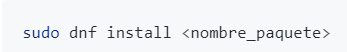
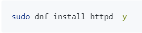
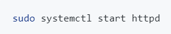
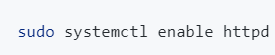
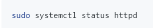
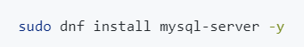
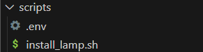
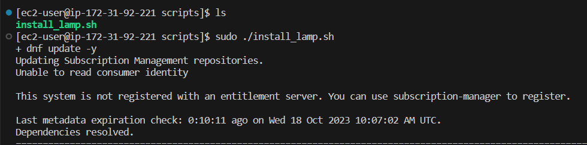

# Practica01-2IAW

# COMENZAMOS CON LA NUEVA PRÁCTICA.

- Como primer paso deberemos darnos cuenta que la extensión para los archivos de instalación, o de cualquier tipo de update dentro del sistena es **_DNF_** por lo tanto tendremos que cambiar con respecto a Ubuntu.

- Lo primero que tendremos que hacer es un *dnf update* que realmente hace la función de upgrade y update al mismo tiempo.

- 

- 
- Descargamos git para poder usar los comandos relacionados con el.

- Hacemos uso del siguiente comando poniendo *_git_* para asi poder hacer uso de su comando.

- 

## Instalar apache2.

- Como primer paso hacemos uso del comando *_sudo dnf install httpd -y_* para instalar el servicio de apache y despues tendremos que activar ese archivo para iniciarlo.

- 

- Para iniciarlo hacemos uso del comando *_sudo systemctl start httpd_*.

- 

- Para habilitar el servicio de arranque automaticamente ocn la máquina hacemos uso de *_sudo systemctl enabled httpd_*

- 

- Y por ultimo para comprobar el estado hacemos uso de *_sudo systemctl status httpd_*

- 

## Instalación de MysqlServer.

- Tendremos que instalar MySqlServer.

- 

- Y para comprobar el funcionamiento de sql asi como arrancar, parar, detener o borrar el servicio podemos hacer uso de los siguientes comandos.

- `sudo systemctl start mysqld`

- `sudo systemctl enable mysqld`

- `sudo systemctl status httpd`

## Instalación de PhPMyAdmin.

- Tendremos que despues de instalar MySqlServer, instalar phpmyadmin, y asi tener también los servicios de la pila LAMP.

- Para instalación hacemos uso de: `sudo dnf install php -y`

- Instalamos la extensión de PhP para la conexión con Mysql haciendo uso del siguiente comando : `sudo dnf install php-mysqlnd -y`
## El siguiente paso es la creación del script.

- El script lo creamos en una carpeta llamada script, el archivo se llamará install_lamp.sh, Es muy importante darle permisos con un chmod +x sobre el archivo para que asi pueda funcionar.

- 

- Aqui podemos ver el funcionamiento del script.

## Cambiar permisos para el directorio.

- Tenemos que cambiar los permisos del propietario /var/www/html. El nuevo propietario tiene que ser apache:apache.

## Directorio temporal.

- El directorio /tmp es un archivo temporal. Cada vez que se reinicia la máquina se borra la "basura" que haya dentro.

# HERRAMIENTAS ADICIONALES ( IMPORTANTE )
- Tenemos que instalar herramientas para que ambos puedan trabajar de manera conjunta, así que lo siguiente que tendremos que hacer es instalar los modulos necesarios de PhP para PhPMyAdmin.

- Usamos el siguiente comando;

- `sudo dnf install php-mbstring php-zip php-json php-gd php-fpm php-xml -y`

- Reiniciaremos el directorio de apache.

- Accederemos dentro de */var/www/html* y descargaremos wget.

- `sudo dnf install wget -y`

- Descargamos el codigo fuente de PhpMyAdmin con la URL de la página oficial.

- `sudo wget https://www.phpmyadmin.net/downloads/phpMyAdmin-latest-all-languages.tar.gz`

- Y tendremos que descomprimir el archivo dentro del directorio que hemos comentado anteriormente.

## Comando SED.

- Nos sirve como una "navaja suiza" para buscar cosas en un archivo de texto. Sirve para buscar cadenas. Tiene diferentes funciones.

- Ej: 's/pepe/PEPE' prueba --> Cambiaria el nombre de pepe de minuscula a mayuscula en el archivo prueba.

- EJ:  -i 's/pepe/PEPE' --> Cambia permanentemente el nombre.