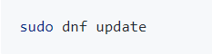
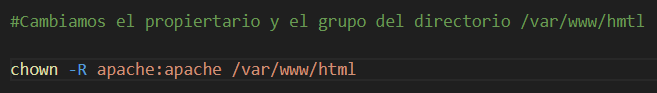
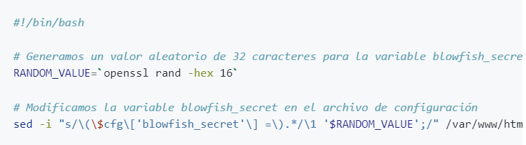
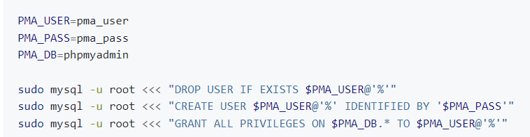

# Practica01-2IAW

# COMENZAMOS CON LA NUEVA PRÁCTICA.

- Como primer paso deberemos darnos cuenta que la extensión para los archivos de instalación, o de cualquier tipo de update dentro del sistena es **_DNF_** por lo tanto tendremos que cambiar con respecto a Ubuntu.

- Lo primero que tendremos que hacer es un *dnf update* que realmente hace la función de upgrade y update al mismo tiempo.

- 

- 
- Descargamos git para poder usar los comandos relacionados con el.

- Hacemos uso del siguiente comando poniendo *_git_* para asi poder hacer uso de su comando.

- 

## Instalar apache2.

- Como primer paso hacemos uso del comando *_sudo dnf install httpd -y_* para instalar el servicio de apache y despues tendremos que activar ese archivo para iniciarlo.

- 

- Para iniciarlo hacemos uso del comando *_sudo systemctl start httpd_*.

- 

- Para habilitar el servicio de arranque automaticamente ocn la máquina hacemos uso de *_sudo systemctl enabled httpd_*

- 

- Y por ultimo para comprobar el estado hacemos uso de *_sudo systemctl status httpd_*

- 

## Instalación de MysqlServer.

- Tendremos que instalar MySqlServer.

- 

- Y para comprobar el funcionamiento de sql asi como arrancar, parar, detener o borrar el servicio podemos hacer uso de los siguientes comandos.

- `sudo systemctl start mysqld`

- `sudo systemctl enable mysqld`

- `sudo systemctl status httpd`

## Instalación de PhPMyAdmin.

- Tendremos que despues de instalar MySqlServer, instalar phpmyadmin, y asi tener también los servicios de la pila LAMP.

- Para instalación hacemos uso de: `sudo dnf install php -y`

- Instalamos la extensión de PhP para la conexión con Mysql haciendo uso del siguiente comando : `sudo dnf install php-mysqlnd -y`
## El siguiente paso es la creación del script.

- El script lo creamos en una carpeta llamada script, el archivo se llamará install_lamp.sh, Es muy importante darle permisos con un chmod +x sobre el archivo para que asi pueda funcionar.

- 

- Aqui podemos ver el funcionamiento del script.

## Cambiar permisos para el directorio.

- Tenemos que cambiar los permisos del propietario /var/www/html. El nuevo propietario tiene que ser apache:apache.

## Directorio temporal.

- El directorio /tmp es un archivo temporal. Cada vez que se reinicia la máquina se borra la "basura" que haya dentro.

# HERRAMIENTAS ADICIONALES ( IMPORTANTE )
- Tenemos que instalar herramientas para que ambos puedan trabajar de manera conjunta, así que lo siguiente que tendremos que hacer es instalar los modulos necesarios de PhP para PhPMyAdmin.

- Usamos el siguiente comando;

- `sudo dnf install php-mbstring php-zip php-json php-gd php-fpm php-xml -y`

- Reiniciaremos el directorio de apache.

- Accederemos dentro de */var/www/html* y descargaremos wget.

- `sudo dnf install wget -y`

- Descargamos el codigo fuente de PhpMyAdmin con la URL de la página oficial.

- `sudo wget https://www.phpmyadmin.net/downloads/phpMyAdmin-latest-all-languages.tar.gz`

- Y tendremos que descomprimir el archivo dentro del directorio que hemos comentado anteriormente.

- Por ultimo tendremos que renombrar el directorio para llamarlo de una manera especifica:

- Usando el comando `sudo mv phpMyAdmin-5.2.1-all-languages/ phpmyadmin`

- Modificamos los permisos para poder tener control total: `sudo chown -R apache:apache /var/www/html/phpmyadmin`

# Configuración de una variable.

- Creamos el archivo de configuración.

- `sudo cp /var/www/html/phpmyadmin/config.sample.inc.php /var/www/html/phpmyadmin/config.inc.php`

- Un ejemplo de como podian ser las variables son las siguientes:

- 

## Documentación de las variables.

- Esta documentación es extraida de la página web de Jose Juan-

- [Enlace a la página de Jose Juan / IAW ](https://josejuansanchez.org/iaw/practica-01-02-teoria/index.html)

- El comando sed que se utiliza para modificar y eliminar texto en un archivo. Vamos a explicar los parámetros que se han utilizado en el ejemplo anterior.

- i: Indica que queremos que los cambios se tienen que aplicar directamente en el archivo que se pasa como parámetro. Si no se utilizase este paráemtro, los cambios se mostrarían por la salida estándar pero el archivo no se modificaría.

- s/cadena_a_buscar/cadena_de_reemplazo/: La sintaxis Es la sintaxis que se utiliza para buscar y reemplazar texto en un archivo. En este caso, se busca la cadena $cfg['blowfish_secret'] = y se reemplaza por la cadena $cfg['blowfish_secret'] = '$RANDOM_VALUE';.

- Observe que se utiliza la barra invertida o backslash \ para escapar los caracteres (, [ y $.

- En la cadena de reemplazo se utiliza \1 '$RANDOM_VALUE';. El número \1 quiere decir que se debe poner el patrón que hemos buscado, es decir, se pondrá $cfg['blowfish_secret'] = seguido del contenido de la variable $RANDOM_VALUE.

### Ejemplo de la variable.

- Un ejemplo de la variable podría ser el siguiente: `sed -i "/blowfish_secret/a \$cfg\['TempDir'\] = '/tmp';" /var/www/html/phpmyadmin/config.inc.php `

## Configuración de la base de datos.

- Dentro del directorio *_/var/www/html/phpmyadmin/sql/create_tables.sql_* hay un script con la base de datos en sql.

- Para crearlo añadiremos a nuestro script lo siguiente. Logicamente el primer apartado de las variables tendremos que guardarlo en un *.env* y hacer un *source* para añadirlo al script.

- 

## Comando SED.

- Nos sirve como una "navaja suiza" para buscar cosas en un archivo de texto. Sirve para buscar cadenas. Tiene diferentes funciones.

- Ej: 's/pepe/PEPE' prueba --> Cambiaria el nombre de pepe de minuscula a mayuscula en el archivo prueba.

- EJ:  -i 's/pepe/PEPE' --> Cambia permanentemente el nombre.